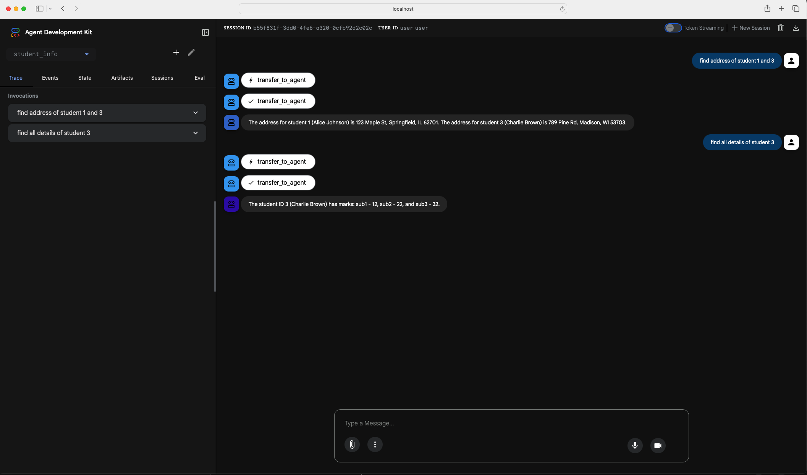

# Google ADK Multi-Agent System

This demo was developed as part Google Agent AI 5 day course [of demo project develop](https://www.kaggle.com/learn-guide/5-day-agents)
A multi-agent system using Google ADK (Agent Development Kit) with A2A (Agent-to-Agent) protocol communication run in your local using docker compose

## Architecture

- **Student Info**: Master Container to search for students address and marks
- **Student Marks**: Remote agent container which provide Marks services
- **Student Address**: Remote agent container which provide Address services


## How to run

Open 3 terminals

### Terminal 1
```bash
cd w5
export export GEMINI_API_KEY=AIzaSyD9tjTf1c.....p
uvicorn remote_agents.student_info_agent.agent:app --host 0.0.0.0 --port 7001

```

### Terminal 2
```bash
cd w5
export export GEMINI_API_KEY=AIzaSyD9tjTf1c.....p
uvicorn remote_agents.student_marks_agent.agent:app --host 0.0.0.0 --port 7002

```


### Terminal 3

```bash
cd w5/local_agent
export export GEMINI_API_KEY=AIzaSyD9tjTf1c.....p
adk web --port 8000 --host 0.0.0.0

```


## Usage

1. Open browser to http://localhost:8000/dev-ui/
2. Use the Google ADK UI to interact with agents
3. Select an agent as "school_agent"
4. Start asking questions

## Test Data
Currently i have only 4 students with student ids as 1,2,3,b102,c103

## Sample questions
1. find address of student 1
2. find all details of student 3
3. find marks of student 1


## Features

- Google ADK integration
- A2A protocol communication
- Docker containerization
- Remote Agents


## Screenshots

